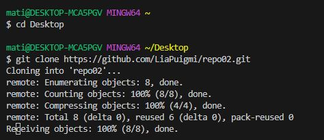
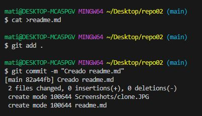
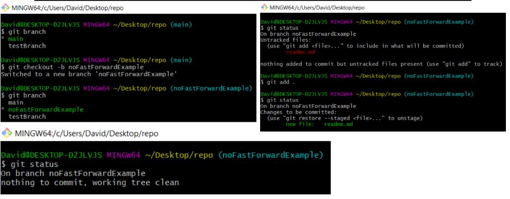
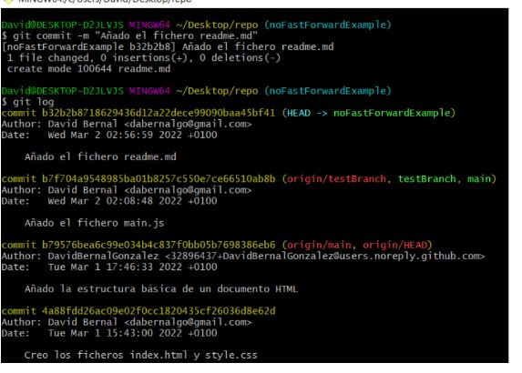
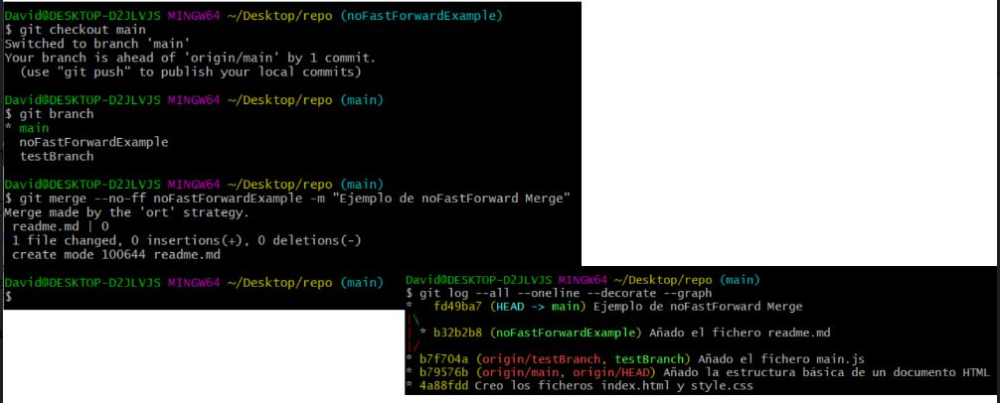

# EJERCICIO 2:
**:one: 2.1 - Crea un repositorio llamado repo02 desde GitHub. ¿Sería considerado un repositorio local o remoto?**
- Remoto

**:two: 2.2 – Posteriormente, clónalo (mediante al comando git clone), lo que realizará una copia del repositorio remoto en nuestro equipo, creando con ello un repositorio local a partir del repositorio en remoto**  
  
**:three: 2-3 - Añade un fichero readme.md y ejecuta los comandos pertinentes hasta llegar a poder realizar un commit.**
  
**:four: 2.4 – Entra en este manual de Markdown y haz un resumen de los principales comandos de Git con los que hemos trabajando. Puedes utilizar tablas, imágenes, títulos, enlaces, etc. IMPORTANTE no subas todo el código de golpe, ya que es mejor que practiques los conceptos.Por tanto, ves subiendo los cambios en distintas subidas a tu repositorio de GitHub y comprobando que los cambios se visualicen correctamente.**  

# GIT

## Comandos:

**Inicio git local:**  
>_$ git init repo_

**Crear archivo readme.md:**  
>_$ cat >readme.md_

**Añadir archivo al String Area:**  
>_$ git add readme.md_ 
  
**Añadir todos los archivos al String Area:**  
>_$ git add ._

**Mirar el estado actual del repo:**  
>_$ git status_ 

**Hacer un snapshot(commit):**  
>_$ git commit -m "mensaje"_

**Ver repositorios remotos asociados:**  
>_$ git remote -v_

**Crear el repo en gitHub, asociarlo, crear branca y subirlo:**  
>  _$ git remote add origin https://github.com/LiaPuigmi/repo01.git_   
  _$ git branch -M main_  
  _$ git push -u origin main_  

**Clonar repo del gitHub:**  
>_$ git clone https://github.com/LiaPuigmi/repo02.git_

**Visualizar un historial con los distintos commits que hemos realizado:**  
>_$ git log_
  - En cada commit, podemos ver:
    >1. El identificador del commit
    >2. El autor del commit
    >3. La fecha del commit
    >4. El mensaje del commit

**Subir los cambios a un repositorio remoto:**  
>_$ git push_

**Bajar los cambios de un repositorio remoto:** 
>_$ git pull_  

**Ver los commits en cada linea y en cual estamos:**  
>_$ git log --graph --oneline --decorate_

**Situarse en otro commit:**
>_$ git checkout commitHash_  

**Ver el hash del siguiente commit:**  
>_$ git log --graph --oneline --decorate --reflog_

**Volver a la main:**
>_$ git checkout main_

**Visualizar cambios desde git:**  
>_$ git show_  

**Crear rama:**  
>_$ git branch nombreRama_

**Visualizar ramas y cambiar:**  
>_$ git branch_

**Situarte a la rama que recibe el merge y hacer merge (fast-forward):**  
>_$ git merge nombreRamaAMergear_

**“Fast forward” (FF)** significa avance rápido y nos permite fusionar la rama que acabamos de crear directamente con la rama main sin realizar un commit de confirmación.
> git merge –ff  
> git merge --ff = git merge Ya que por
defecto se utiliza el --ff por defecto
(default)

**“No Fast Forward” (NFF)** crea una nueva confirmación con varios padres. Lo que proporciona un mejor seguimiento del historial.
> git merge --no-ff newFeature

**Ejemplo No Fast Forward:**  
>_$ git checkout -b NoFastForwardExample_

 
  

**Eliminar rama en local:**
>_$ git branch -d nameBranch_

**Eliminar rama en remoto:**  
>_$ git push origin --delete nameBranch_

### Configurar local git:
***  
>1. $ git config --global user.name "Name"
>    * $ git config user.name
>2. $ git config --global user.email "email"
>    * $ git congig user.email

### Otros comandos:
***
|COMANDO |EXPLICACIÓN |  
|:--- |:----:|
|$ git --version |mirar versión de git |  
|$ pwd |imprime ruta directorio actual |  
|$ ls |listar contenido |
|$ cd |cambiar de directorio |
|$ cd .. |retroceder |
|$ mkdir repo02 |crear directorio |
  

\*:alien::fire::alien::fire::alien::fire::alien::fire::alien::fire:\*